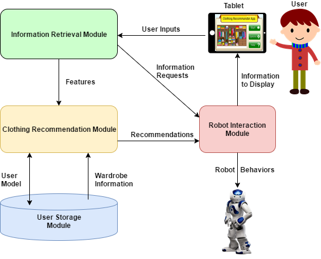

# Robotic Clothing Recommender System

Implementation of a social robotics + machine learning pipeline for personalized, adaptive, clothing recommendation. Developed as part of my Master's research project at U of T.

**Important Note**: This repository will likely be very hard to get up and running yourself due to the dependencies being old versions as of 2019. I recommend learning from it but not trying to go through the effort of getting it functional from scratch.

# Requirements
* Ubuntu 14.04
* ROS Indigo
* Aldebaran Nao robot v3
* Aldebaran Naoqi SDK version 2.4.3
* Python Weka Wrapper
* Java Virtual Machine
* Android Touchscreen with Bluetooth Capabilities
* MySQLdb
* Transitions

